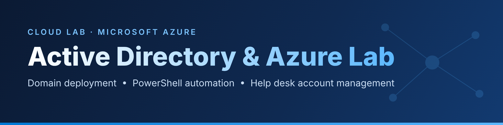

In this lab, I built a Windows domain in Microsoft Azure and performed the account administration tasks a help desk handles every day. I deployed a domain controller and a client machine, joined the client to the domain, organized the domain with OUs and security groups, created users in bulk with PowerShell, and used Group Policy to lock out accounts after failed logins. I then unlocked those accounts and reset their passwords using both the graphical tools and PowerShell.

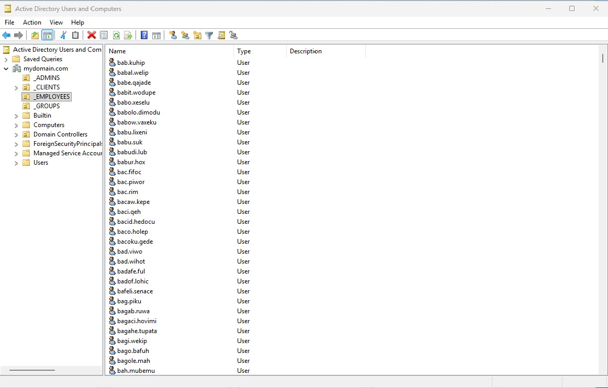

## Summary

**Languages:** PowerShell

**Environments:** Microsoft Azure, Windows Server 2022, Windows 10

**Technologies:** Azure Virtual Machines, Azure Virtual Networks, Active Directory Domain Services, Active Directory Users and Computers, Group Policy, DNS, Remote Desktop

## Demonstration

**1. Set up the Azure virtual machines**

Created a domain controller (DC-1) and a client (Client-1) in the same virtual network, and set DC-1's private IP address to static.

*Why it matters:* every computer on the domain finds the domain controller through its IP address. If that address changed, logins would fail across the whole network.

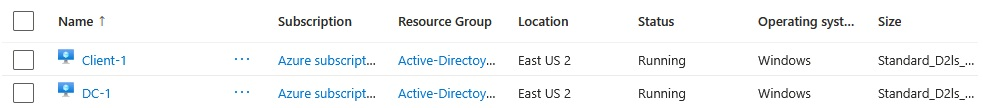

**2. Install Active Directory**

Installed Active Directory Domain Services on DC-1 and promoted it to a domain controller for `mydomain.com`. DNS was installed along with it.

*Why it matters:* this turns a regular server into the central system that controls who can log in and what they can access.

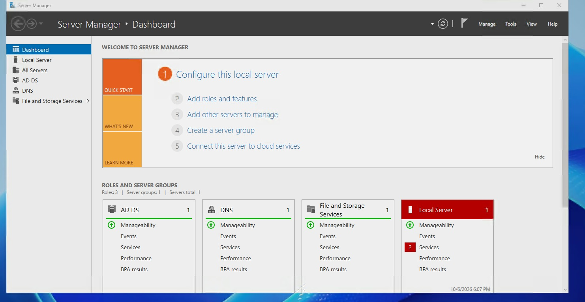

**3. Create OUs and an admin account**

Created four organizational units: `_ADMINS`, `_EMPLOYEES`, `_CLIENTS`, and `_GROUPS`. Then created an admin account (Jane Doe) in `_ADMINS` and added it to Domain Admins.

*Why it matters:* separating users, admins, and computers makes it possible to apply different policies to each, and keeps admin accounts easy to audit.

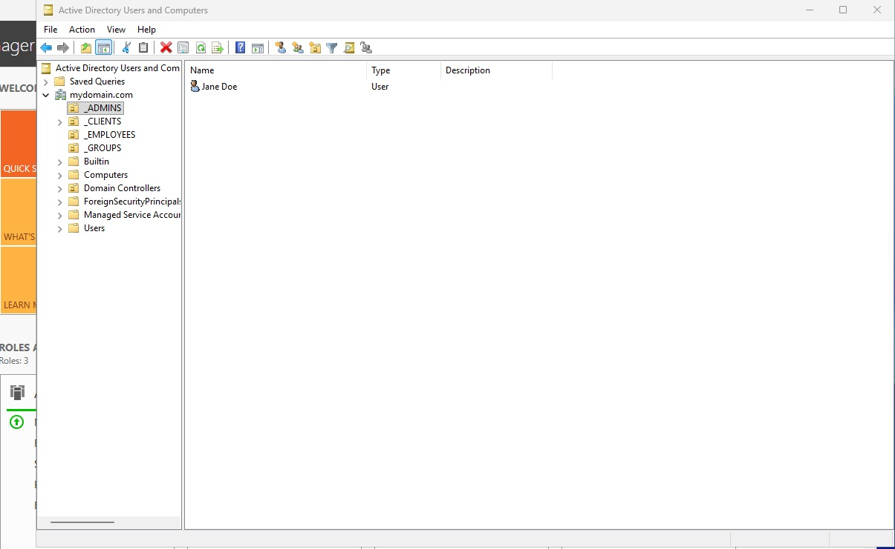

**4. Join Client-1 to the domain**

Pointed Client-1's DNS to DC-1, joined it to the domain, and moved it into the `_CLIENTS` OU.

*Why it matters:* a computer finds its domain through DNS. Wrong DNS settings are one of the most common reasons a domain join fails.

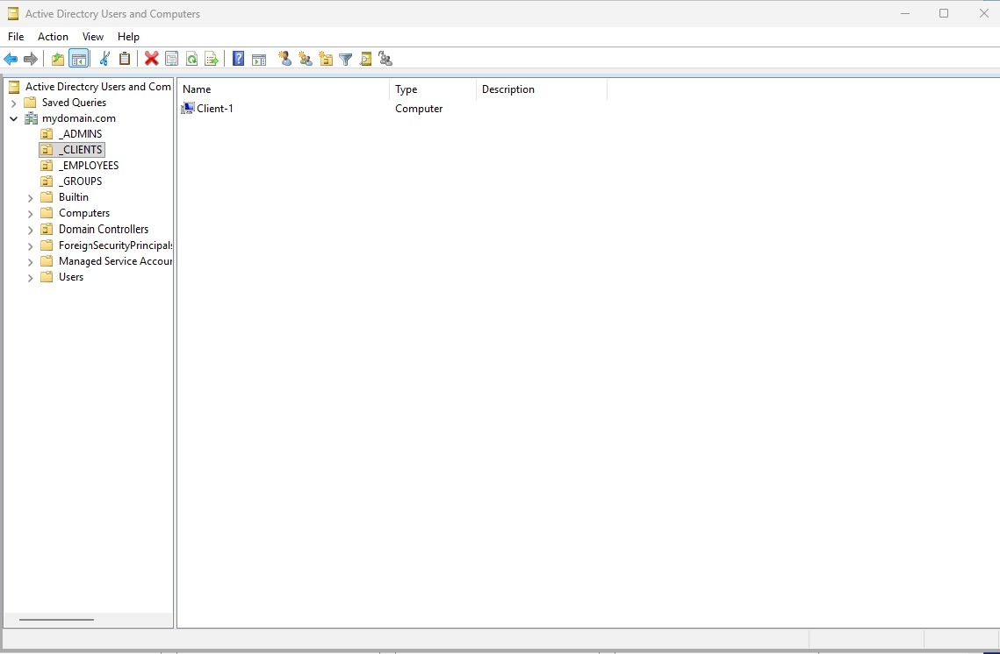

**5. Create a security group**

Created an `ACCOUNTANTS` security group in the `_GROUPS` OU.

*Why it matters:* permissions are assigned to groups, not individual users. When someone joins or leaves a team, the help desk only has to change their group membership.

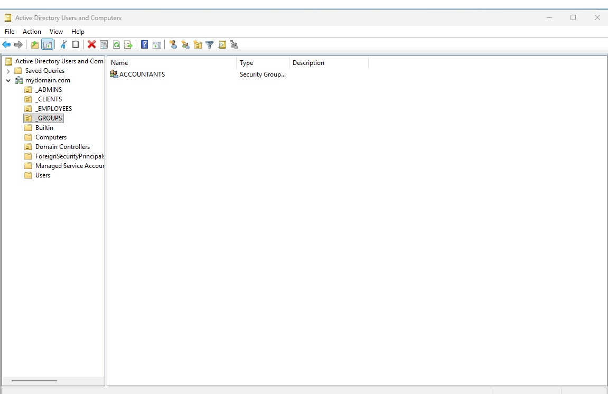

**6. Create users with PowerShell**

Ran a PowerShell script provided by the course to create users in bulk inside the `_EMPLOYEES` OU. The script generates a random name, sets a password, and creates the account with `New-ADUser`, repeating until it reaches the number set at the top of the script.

*Why it matters:* creating accounts one at a time doesn't scale. A script does in seconds what would take hours by hand.

*Note:* the script uses one hard-coded password for every user and sets passwords to never expire. That's fine for a lab, but in production I would avoid both.

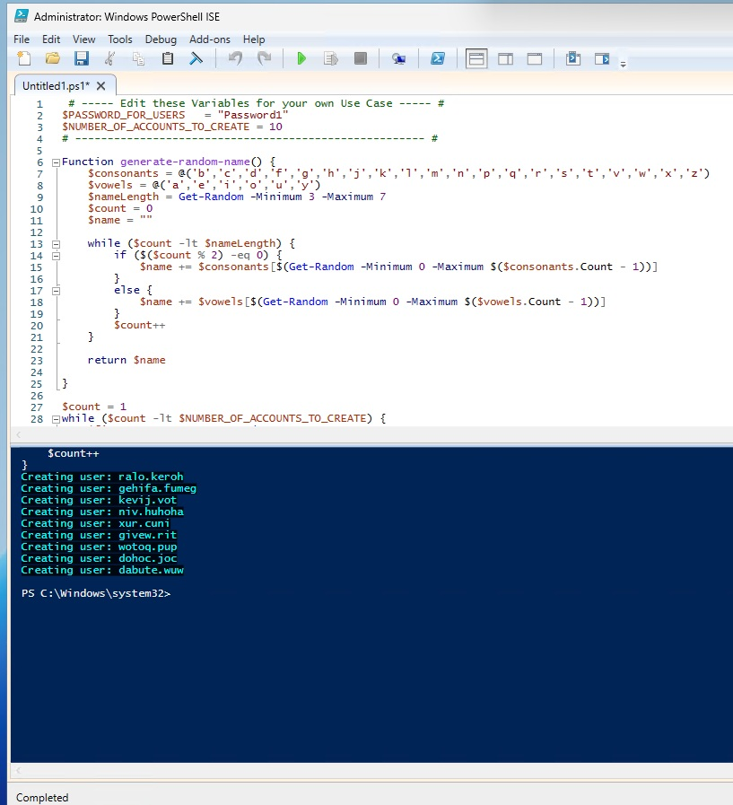

**7. Configure an account lockout policy**

In Group Policy, set the Default Domain Policy to lock an account for 30 minutes after 5 failed login attempts.

*Why it matters:* lockout policies stop attackers from guessing passwords over and over.

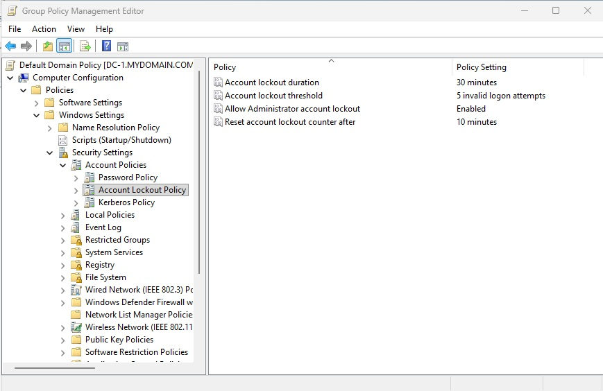

**8. Lock out an account**

Logged in to Client-1 with the wrong password until the account locked.

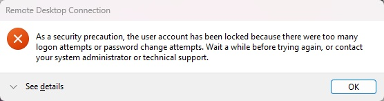

**9. Unlock the account**

Searched for the user in Active Directory Users and Computers and unlocked the account from the **Account** tab.

*Tip:* the console only lists the first 2,000 objects in a folder, so with thousands of users, **Find** is the fastest way to locate an account.

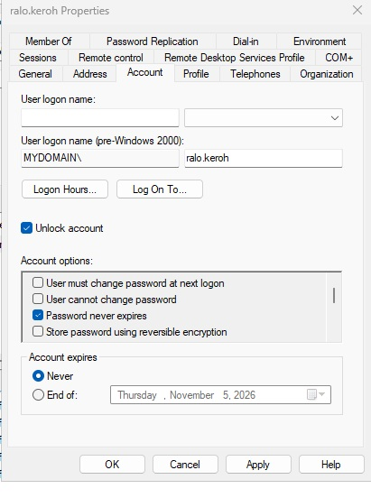

## Real Ticket Walkthrough

> **Ticket:** "I can't log in. It says my account is locked." (User: bad.viwo)

**Step 1: Verify the user's identity** before making any changes to their account.

**Step 2: Find locked accounts**

```powershell
Search-ADAccount -LockedOut | Select-Object Name, SamAccountName
```

**Step 3: Unlock the account**

```powershell
Unlock-ADAccount -Identity bad.viwo
```

**Step 4: Reset the password**

```powershell
Set-ADAccountPassword -Identity bad.viwo -Reset -NewPassword (Read-Host -AsSecureString "New password")
```

**Step 5: Require a password change at next login**

```powershell
Set-ADUser -Identity bad.viwo -PasswordNeverExpires $false
Set-ADUser -Identity bad.viwo -ChangePasswordAtLogon $true
```

**Step 6: Confirm the fix.** Running the search again returns nothing, so no accounts are locked. Then confirm the user can log in, document the fix, and close the ticket.

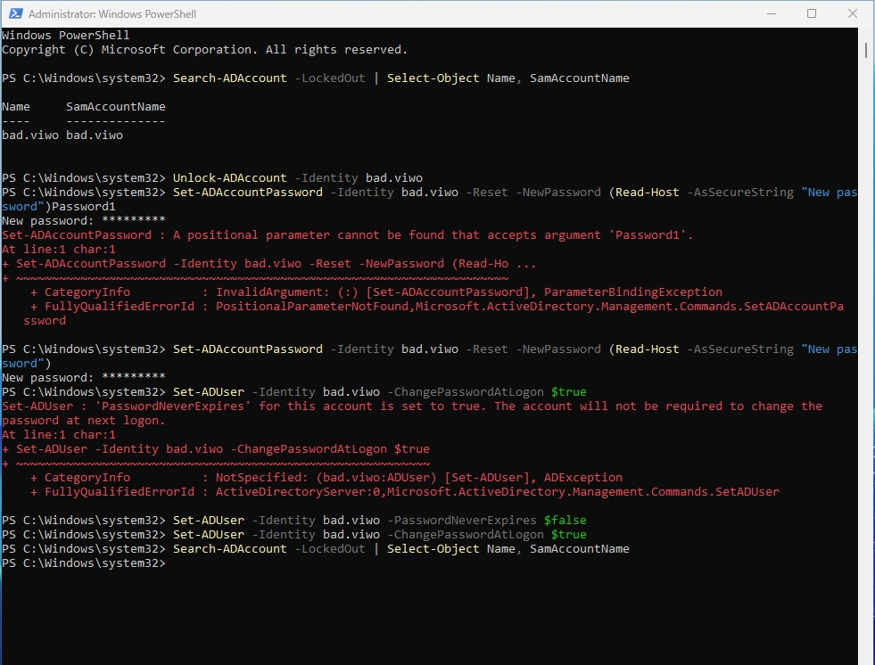

## Troubleshooting

**Error: "A positional parameter cannot be found that accepts argument..."**
I typed the new password on the same line as the command. `Read-Host` prompts for the password separately, so the fix was to run the command alone and enter the password at the prompt. Typing it at the prompt also keeps it hidden on screen.

**Error: "'PasswordNeverExpires' for this account is set to true."**
The user-creation script had set passwords to never expire, and Windows won't require a password change while that setting is on. I turned off `PasswordNeverExpires` first, then the change-at-next-login setting applied.

## Security Takeaways

- **Lockout policies have a trade-off.** Too strict, and users get locked out constantly. Too loose, and attackers can keep guessing passwords.
- **Always verify identity before a reset.** Attackers often call help desks pretending to be users.
- **Forcing a password change at next login** means the help desk never knows the user's final password.
- **Passwords that never expire are a risk.** The second error above showed how that setting can quietly block normal security controls.
- **Separating admin accounts** limits the damage if a regular account is compromised.
